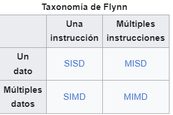
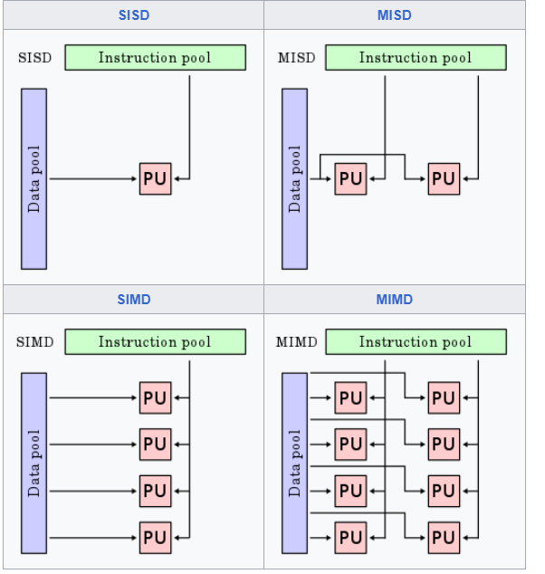

### Concepto de Taxonomía

**Taxonomía** es la ciencia de la clasificación. En un contexto general, se refiere a la categorización de entidades en grupos basados en características compartidas. Esta clasificación ayuda a organizar y entender las relaciones y diferencias entre diversas entidades. En computación, la taxonomía se utiliza para clasificar diferentes tipos de sistemas y arquitecturas.

### Taxonomía de Flynn

La **taxonomía de Flynn**, propuesta por Michael J. Flynn en 1966, es una clasificación de las arquitecturas de computadoras basada en el número de flujos de datos e instrucciones que pueden manejar simultáneamente. La taxonomía de Flynn clasifica las arquitecturas en cuatro categorías principales:

1. **SISD (Single Instruction, Single Data)**: 
   - Un solo flujo de instrucciones que opera en un solo flujo de datos.
   - Ejemplo: Procesador de un solo núcleo.

2. **SIMD (Single Instruction, Multiple Data)**:
   - Un solo flujo de instrucciones que opera en múltiples flujos de datos.
   - Ejemplo: Procesadores vectoriales, algunas unidades de procesamiento gráfico (GPU).

3. **MISD (Multiple Instruction, Single Data)**:
   - Múltiples flujos de instrucciones que operan en un solo flujo de datos.
   - Ejemplo: Este tipo es más teórico y rara vez se encuentra en la práctica.

4. **MIMD (Multiple Instruction, Multiple Data)**:
   - Múltiples flujos de instrucciones que operan en múltiples flujos de datos.
   - Ejemplo: Sistemas multiprocesador, clusters de computadoras.

### Clasificación de OPENMP, MPI y Multiprocessing en Python según la Taxonomía de Flynn

1. **OPENMP (Open Multi-Processing)**:
   - **Clasificación**: **SIMD**.
   - **Justificación**: OpenMP es un modelo de programación para sistemas de memoria compartida. Utiliza una sola secuencia de instrucciones que se distribuye entre múltiples núcleos para operar en diferentes partes de los datos. Cada hilo de ejecución sigue el mismo flujo de instrucciones pero opera en diferentes porciones de datos.
   
2. **MPI (Message Passing Interface)**:
   - **Clasificación**: **MIMD**.
   - **Justificación**: MPI es un modelo de programación para sistemas de memoria distribuida. Permite que múltiples procesos ejecuten diferentes flujos de instrucciones y operen en diferentes datos. Estos procesos pueden estar en diferentes nodos de un cluster y se comunican mediante el paso de mensajes. Cada proceso en un programa MPI puede ejecutar un conjunto distinto de instrucciones en datos distintos.
   
3. **Multiprocessing en Python**:
   - **Clasificación**: **MIMD**.
   - **Justificación**: El módulo `multiprocessing` en Python permite crear múltiples procesos, donde cada proceso puede ejecutar diferentes flujos de instrucciones y operar en diferentes datos. Al igual que MPI, cada proceso en `multiprocessing` es independiente y puede ejecutar código distinto en datos distintos.
### Diagrama de comparación de las clasificaciones de la Taxonomía de Flynn

### Resumen

- **OPENMP**: Clasificado como SIMD porque utiliza un solo flujo de instrucciones distribuido entre múltiples núcleos, operando en diferentes partes de los datos.
- **MPI**: Clasificado como MIMD porque permite múltiples procesos, cada uno ejecutando diferentes flujos de instrucciones y operando en diferentes datos, típicamente en un entorno de memoria distribuida.
- **Multiprocessing en Python**: Clasificado como MIMD porque permite la ejecución de múltiples procesos independientes, cada uno con su propio flujo de instrucciones y datos, similar a MPI pero generalmente en un entorno de memoria compartida.